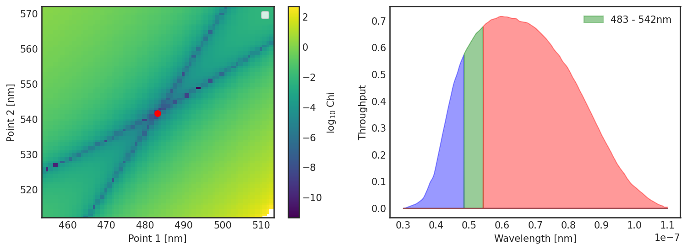

oopmh
-----

Package to access CoRoT multiband photometry data, and fit flare profiles.

CoRoT uniquely obtained multiband photometry for thousands of targets on their planet detector. In this package we provide tools to 1) calibrate this photometry and 2) use it to fit flare energies.

An example of the calibration is shown below:



To install you can use

```
pip install oomph
```

And for an example of how to use the tool you can either follow the `demo.py` notebook. To download the data for a given target you can use the following:

```python
import oomph
c = oomph.CoRoTMultiPhotometry.from_archive(id=221647275, teff=3984)
```

The tool will alert you if there is no color photometry for the input target.
